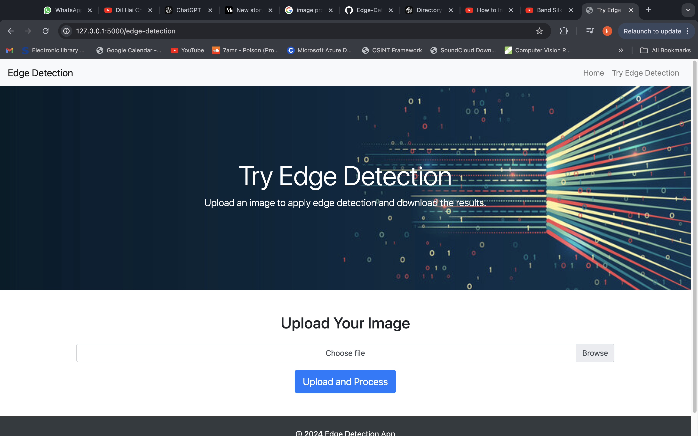
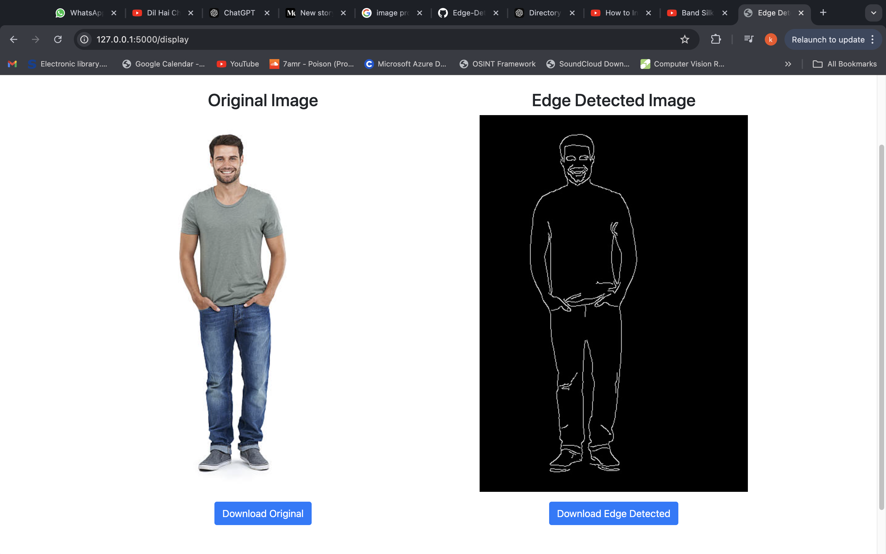

# edge-detection-web-app# Edge-Detection-with-OpenCV
# Edge Detection Web App


## Screenshots

### Home Page



### Edge Detection Results Page



## Table of Contents
- [Overview](#overview)
- [Features](#features)
- [Installation](#installation)
- [Project Structure](#project-structure)
- [Usage](#usage)
- [Technologies Used](#technologies-used)


## Overview
The **Edge Detection Web App** is a simple Flask-based web application that allows users to upload an image, apply Canny edge detection to the image, and view or download both the original and processed images. Edge detection is a technique used in image processing to identify the boundaries of objects within an image.

## Features
- Upload any image.
- Apply Canny edge detection to the uploaded image.
- View the original and processed images side by side.
- Download the original and edge-detected images.
- Responsive design for a seamless experience on all devices.

## Installation

### Prerequisites:
- Python3 installed on your machine.
- `pip` package manager.
- Virtual environment (optional but recommended).

### Steps:
# 1. Clone the repository to your local machine:
   
     git clone https://github.com/kunal0230/edge-detection-web-app.git

# 2. Navigate into the project directory
  
    cd edge-detection-web-app
# 3. Install Install Required Dependencies:

    pip install -r requirements.txt
# 4. Start the Flask Development Server:
    python app.py
# 5. Usage Instructions in the Browser:
    Once the server is running, open your browser and navigate to
     http://127.0.0.1:5000/


```bash
#Project Structure

edge-detection-web-app/
│
├── static/                   # Static assets (images, CSS)
│   ├── images/               # Images used in the project
│   │   ├── banner.jpg        # Background image for the homepage
│   │   └── edge2-1.png       # Another image
│   ├── css/
│   │   └── styles.css        # Custom styles for the project
│
├── templates/                # HTML templates for Flask
│   ├── index.html            # Homepage
│   ├── edge_detection.html   # Image upload page
│   └── display.html          # Output page for displaying results
│
├── app.py                    # Main Flask app
├── Edge_Detection.py         # Edge detection logic (if separate from Flask app)
├── requirements.txt          # Project dependencies
├── README.md                 # Project README file
└── .gitignore                # Git ignored files and directories


Usage
Home Page: The homepage provides an overview of edge detection and a "Try Edge Detection" button.

Upload Image: Click on the "Try Edge Detection" button to navigate to the upload page, where you can select an image from your device.

View and Download Results: Once the image is uploaded and processed, you can view both the original and processed images. There are also options to download both images.

Technologies Used
Python: Programming language.
Flask: Web framework for Python to build the web application.
OpenCV: Python library for image processing (for edge detection).
HTML5/CSS3: Frontend structure and styling.
Bootstrap 4: Responsive design and UI components.

